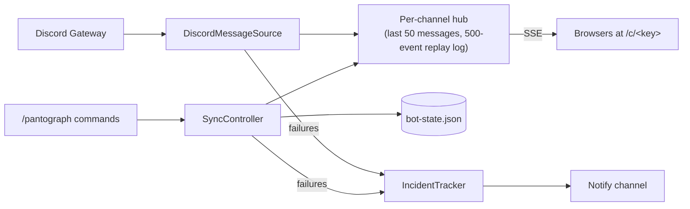

# Pantograph

```text
 ━━━━━━━━━━━━━━━━━━━━━━━━━━━━━━━━━━━━━━━━━━━━━━━━━━━━━━━━━━━━━
                         ════╤════
                            ╱ ╲
                           ╱   ╲
                           ╲   ╱
                            ╲ ╱
          ┌──────────────────┴──────────────────┐
          │ ▣   ▣   ▣   ▣   ▣   ▣   ▣   ▣   ▣   │
          └───◎──◎─────────────────────────◎──◎─┘
```

**Discord channels, live on the web.**

A pantograph is the arm on top of an electric train that stays in contact with the overhead
wire. This one keeps contact with Discord instead: a bot listens to the channels you pick and a
small web server streams every new message, edit and deletion to anyone who has the link. No
Discord account needed on the reading end.

I built it as a portfolio project for [Railway](https://railway.com), hence the theme.

## What it does

- **Real time.** New messages arrive within a second, edits update in place, deletions disappear.
- **One unlisted link per channel**, for as many channels and servers as you like.
- **Looks like Discord.** Markdown, spoilers, mentions, timestamps, custom emoji, images and
  stickers, animated ones included.
- **Moderator controls.** Pause, rotate a leaked link or stop mirroring with one slash command.
- **Reports its own problems**, as one self-updating message instead of a flood.
- **Accessible.** Screen readers, keyboard, and "reduce motion" are all taken care of.

## The web page

The channel page is a station departure board. The board is the station and the messages are the
passengers. Only the chrome is themed; messages look like messages.

The header shows **TIME** (a live clock), **SERVICE** (the channel), **PLATFORM** (a number
derived from the channel id: decorative, but stable) and **STATUS**, which tells you how the
connection is doing:

| Status           | Meaning                                                |
| ---------------- | ------------------------------------------------------ |
| `BOARDING`       | Connecting                                             |
| `ON TIME`        | Live                                                   |
| `DELAYED`        | Lost the connection, reconnecting                      |
| `HELD AT SIGNAL` | A moderator paused the channel                         |
| `CANCELLED`      | The link is no longer active (rotated or unwatched)    |

A few more details:

- The little pantograph in the corner is raised against the wire while the stream is live and
  folds down when it isn't. It sparks on every new message.
- Scrolled up to read something? New arrivals are counted in a "now approaching" pill at the
  bottom instead of yanking the page. Click it to jump to the latest.
- There's an opt-in station chime for new messages. It's off by default and your browser
  remembers the choice.
- Screen readers get each new message once, as "author: text". Spoilers are read as "spoiler".
  Loading the page, reconnecting and edits announce nothing.

The board font is [Departure Mono](https://departuremono.com)
([SIL OFL 1.1](frontend/public/fonts/DepartureMono-LICENSE.txt)).

## Commands

Everything lives under one slash command, `/pantograph`. It works on the server you run it in,
only members with **Manage Server** can use it, and replies are visible only to you.

| Command                         | What it does                                                                                           |
| ------------------------------- | ------------------------------------------------------------------------------------------------------ |
| `/pantograph watch #channel`    | Start mirroring a text or announcement channel and get its link. Loads the last 50 messages. Running it again gives you the same link |
| `/pantograph status [#channel]` | Mirrored channels (up to 10) with their links, running or paused, viewers, buffered messages and last event. Also gateway ping and open problems |
| `/pantograph pause [#channel]`  | Stop forwarding one channel, or every channel in the server. Viewers see `HELD AT SIGNAL`              |
| `/pantograph resume [#channel]` | Re-sync recent history and carry on                                                                    |
| `/pantograph rotate #channel`   | Issue a new link. The old one stops working immediately                                                |
| `/pantograph unwatch #channel`  | Stop mirroring. The link stops working and viewers are disconnected                                    |
| `/pantograph notify #channel`   | Where the bot should post problem reports for this server. Without it, problems only go to the logs     |

Manage Server is Discord's default permission for the command, and server admins can loosen it
under Server Settings → Integrations. The bot checks the permission again on its own, so loosening
it doesn't hand out links.

The bot's status sums up the state across all servers: "Watching #general",
"Watching 3 channels (1 paused)", or "Watching nothing yet · /pantograph watch" on a fresh
install. It goes idle when everything is paused.

## Links and privacy

A channel link looks like `/c/k7fq-2x9p-lm3n-r8st`: about 80 bits of randomness, not guessable.
Think of it as an unlisted video. Anyone who has it can read along without logging in, so share it
deliberately.

- The bot shows links only in replies that only you can see, never in a channel.
- `rotate` replaces a link and `unwatch` kills it. Viewers on a dead link see the board flip to
  `CANCELLED`. Deleting the channel or removing the bot does the same.
- Links stay out of `/api/health` and the logs, but like any URL they end up in browser history
  and proxy logs. If one leaks, `rotate` it.
- Pages ship a strict Content Security Policy (own origin only, plus Discord's CDN for images),
  `Referrer-Policy: no-referrer` and the usual hardening headers.

## When things go wrong

Problems a moderator can fix (an unreadable channel, history that won't load, commands that
couldn't be registered) are posted to the notify channel as **one message per problem and
channel**. Repeats update that message at most every five minutes instead of posting again, and it
turns into a green "Resolved" once the problem clears. Everything also goes to the log, and
`/pantograph status` lists whatever is still open.

Gateway hiccups are handled by discord.js, which resumes and replays what was missed. After an
outage longer than a minute the bot posts one "connection restored" notice. If Discord starts a
fresh session instead, recent history is re-synced so nothing slips through.

## All aboard: setting it up

### Prerequisites

- Node.js 24.12 or newer (see [`.nvmrc`](.nvmrc)). The backend relies on Node 24 running
  TypeScript directly, so older versions won't do.
- npm 11, which ships with Node 24.
- A Discord server where you have **Manage Server**.

### 1. Create the Discord application

1. In the [Discord Developer Portal](https://discord.com/developers/applications), click
   **New Application** and give it a name ("Pantograph" works).
2. Under **Bot**:
   - Click **Reset Token** and copy the token. It goes into `.env` in the next step.
   - Under **Privileged Gateway Intents**, enable **Message Content Intent**.
3. Under **Installation**:
   - Keep **Guild Install** enabled. You don't need User Install.
   - Under **Default Install Settings → Guild Install**, add the scopes `applications.commands`
     and `bot`, and the permissions **View Channels**, **Read Message History** and
     **Send Messages**.

> [!NOTE]
> Without the Message Content intent Discord hands the bot messages with the text cut out, which
> makes for a rather quiet mirror. Once the bot reaches 10,000 users, Discord requires a
> [review](https://support-dev.discord.com/hc/en-us/articles/6205754771351-How-do-I-get-Privileged-Intents-for-my-bot)
> to keep the intent. Until then, flipping the toggle is enough.

You don't need to build an invite link by hand. The bot logs one every time it starts.

### 2. Configure

```sh
cp .env.example .env      # then paste DISCORD_TOKEN
npm install
```

[`.env.example`](.env.example) has everything, commented. The variables are read in
[`backend/src/config.ts`](backend/src/config.ts):

| Variable        | Default                       | What it's for                                                   |
| --------------- | ----------------------------- | --------------------------------------------------------------- |
| `DISCORD_TOKEN` | required                      | Bot token from the Developer Portal                             |
| `PORT`          | `3000`                        | Web server port                                                 |
| `HOST`          | `127.0.0.1`                   | Bind address. Use `0.0.0.0` behind a reverse proxy or on Railway |
| `PUBLIC_URL`    | `http://localhost:5173` in dev, `http://localhost:$PORT` in production | Origin the channel links are built from. Set it to whatever address viewers use |
| `STATE_FILE`    | `backend/data/bot-state.json` | Where mirrored channels, their links and paused flags are kept  |
| `LOG_LEVEL`     | `info`                        | `debug`, `info`, `warn` or `error`                              |

### 3. Run it

```sh
npm run dev
```

This starts the backend on <http://127.0.0.1:3000> (it restarts when you save a file) and the web
page on <http://localhost:5173> (with hot reload). The backend log prints an **Install link**.
Open it, pick your server and confirm. Then, in Discord:

```text
/pantograph watch #the-channel
```

You'll get a link like `http://localhost:5173/c/k7fq-2x9p-lm3n-r8st`. Open it. Recent history is
already there, and anything posted from now on arrives within a second.

For production, a single server builds the page and serves it too:

```sh
npm run build
PUBLIC_URL=https://mirror.example.com npm start
```

### Deploying on Railway

[`railway.json`](railway.json) already sets the build and start commands and the `/api/health`
healthcheck. What's left:

1. **Attach a volume** (say at `/data`) and set `STATE_FILE=/data/bot-state.json`.
2. Set `HOST=0.0.0.0`. The default `127.0.0.1` can't be reached from Railway's proxy, so the
   healthcheck fails. Railway injects `PORT` itself.
3. Set `DISCORD_TOKEN`, and set `PUBLIC_URL` to the service's public domain, for example
   `https://pantograph-production.up.railway.app`.
4. Keep a single replica. Two instances would open two Gateway sessions and each would serve its
   own half of the viewers.

> [!WARNING]
> Without a volume the state file lives on the container's ephemeral disk. Every deploy forgets
> every mirrored channel and every link stops working.

During a deploy the old and new containers overlap for a few seconds. That's harmless: the old one
gets `SIGTERM`, and viewers reconnect to the new one and get a fresh snapshot.

## Signal failures (troubleshooting)

| Symptom                                                         | Fix                                                                                     |
| --------------------------------------------------------------- | --------------------------------------------------------------------------------------- |
| Startup says Discord refused the Message Content intent (4014)  | Enable **Message Content Intent** under Bot → Privileged Gateway Intents                |
| Messages arrive with empty text                                 | Same thing. The intent was turned on after the bot connected, so restart it             |
| `/pantograph` doesn't show up in Discord                        | The bot was added without the `applications.commands` scope. Re-add it with the install link from the log |
| `/pantograph watch` complains about permissions                 | Give the bot **View Channel** and **Read Message History** in that channel              |
| A link opens but the board says `CANCELLED`                     | It was rotated or unwatched, or the state file is gone. `/pantograph status` has the current link |
| Links point at the wrong host                                   | Set `PUBLIC_URL` to the address viewers use                                             |
| Startup says the state file is from an earlier version          | Delete it and `/pantograph watch` again                                                 |
| Attachments stop loading after a day or so                      | Discord signs attachment URLs and they expire. Given how short the live window is, this rarely matters |

Other fatal Gateway close codes (a bad token, for example) are explained in plain words at
startup. The whole list is in
[`gatewayCloseCodes.ts`](backend/src/discord/gatewayCloseCodes.ts). The process then exits with
code 3 so a supervisor can restart it.

## Under the hood

Everything runs in one Node.js process: a [discord.js](https://discord.js.org) bot on the Gateway
and a [Hono](https://hono.dev) server that pushes events to browsers over Server-Sent Events.
There's no build step for the backend, because Node 24 runs the TypeScript as is.



| Directory                | What's in it                                                                               |
| ------------------------ | ------------------------------------------------------------------------------------------ |
| [`shared/`](shared)      | The wire protocol both sides agree on ([`protocol.ts`](shared/src/protocol.ts))            |
| [`backend/`](backend)    | Bot, per-channel hubs, HTTP and SSE server. Starts at [`main.ts`](backend/src/main.ts)     |
| [`frontend/`](frontend)  | Vite, vanilla TypeScript and Tailwind. `/` is a landing page, `/c/<key>` is a channel      |
| [`e2e/`](e2e)            | Playwright tests plus a fake two-channel backend for them to drive                         |

The HTTP surface is small:

- `GET /api/channels/<key>`: channel name and paused flag, or `404`. The page checks it before
  opening the stream and after every disconnect, since `EventSource` can't see status codes.
- `GET /api/channels/<key>/stream`: the SSE stream. `Last-Event-ID` replays what you missed, or
  you get a fresh snapshot if that's too far back.
- `GET /api/stickers/<id>`: cached proxy for Lottie stickers, which Discord's CDN serves without
  CORS headers.
- `GET /api/health`: the healthcheck.

### Working on it

```sh
npm run check        # Biome lint and format check (npm run check:fix to apply)
npm run typecheck    # tsc in every workspace
npm run test:e2e     # builds the frontend, starts the fake backend, runs Playwright
```

The first e2e run needs a browser: `npx playwright install chromium`.

Because Node strips the types instead of compiling them, the backend has to stay within the
erasable subset: no `enum`, no parameter properties, `.ts` extensions on relative imports and
`import type` for types. [Biome](biome.json) and `tsc` both enforce it.

### Scaling notes

- **One process** handles a few thousand viewers on a small VM, at tens of kilobytes per SSE
  connection (raise `ulimit -n` past ~10k). Bandwidth is the real cost: every Discord event is a
  ~1 KB frame per viewer. Each channel keeps 50 messages and 500 events in memory, well under a
  megabyte.
- **Already built in:** events are serialized once per channel, viewers more than 100 events
  behind are dropped and reconnect, a 25-second heartbeat keeps proxies happy, and past 5,000
  viewers the server answers `503` with `Retry-After`.
- **Going horizontal:** the Gateway connection must stay in one process, since a second one would
  duplicate every event. Publish hub events to Redis or NATS and run stateless SSE relays behind a
  load balancer. For huge, latency-tolerant audiences, push a JSON snapshot per channel to a CDN and
  let browsers poll it.

### Why SSE, and why no framework

SSE rather than WebSockets: the data only flows one way, `EventSource` reconnects and replays for
free, and it's plain HTTP, so it gets along with every proxy and with HTTP/2 multiplexing.

The frontend is vanilla TypeScript. A store emits one change per stream event and a renderer
applies it to the DOM, patching rows in place so focus, revealed spoilers and running sticker
animations survive an edit. The main bundle is 18 KB gzipped.

<details>
<summary>The alternatives I considered</summary>

| Option           | For                                                                                        | Against                                                                         |
| ---------------- | ------------------------------------------------------------------------------------------ | ------------------------------------------------------------------------------- |
| Vanilla (chosen) | No runtime. Every DOM effect is explicit, and the imperative bits (split-flap, Lottie, WebAudio, departure animations) need no wrappers | Each new piece of per-message state needs its own patch path |
| Solid            | Fine-grained updates and keyed lists keep DOM nodes stable, which suits a diff-emitting store | New toolchain for a single list. The imperative bits stay imperative            |
| Preact           | React's model in about 4 KB                                                                 | Re-renders the list per event unless memoised. Exit animations need extra lifecycle work |
| React            | Everyone knows it                                                                           | About 45 KB, exit animations need a library, and StrictMode's double effects fight the Lottie player |

Richer rows (reactions, reply previews, embeds, grouping consecutive messages by author) are where
Solid would start paying for itself.

</details>

## Mind the gap: known limitations and future work

This is a portfolio project, so I've written these down rather than fixed them. Each one comes
with a rough idea of what the fix would take.

- **Edits to old messages can be missed.** When discord.js no longer has a message cached, an edit
  arrives as a partial update and gets dropped, even if the browser still shows that message.
  Calling `await message.fetch()` on partial updates would fix it, at one REST call each.
- **Channel renames** only show up after the next re-sync, because nothing handles `ChannelUpdate`.
- **Two moderators running `/pantograph watch`** on the same channel at the same moment can end up
  with two keys. The second one wins.
- **The viewer cap is global.** One very popular channel can use up all 5,000 slots for everyone.
  Per-channel and per-IP caps would be next. There's no rate limiting at all.
- **Scrollback shrinks after a deploy.** The browser keeps up to 500 messages, but a fresh snapshot
  replaces them with the server's 50. Merging would keep the scrollback but miss older messages
  that were deleted during the outage.
- **`/api/health` is public** and reveals channel and viewer counts. Fine for a healthcheck. A real
  product would split it.
- Unknown `/api/...` paths fall through to the web page and return `index.html` with a 200.
- Replies aren't rendered (the reference is on the wire as `replyToMessageId`), Markdown lists
  aren't parsed and embeds aren't shown.
- Threads and forum posts under a mirrored channel aren't mirrored.
- The e2e suite runs in Chromium only and doesn't cover reconnect-and-replay yet.

<details>
<summary>Feature ideas, with rough effort</summary>

| Feature | Effort | What it takes |
| --- | --- | --- |
| Browser notifications while the tab is in the background | Small | Ask for permission on the announcements toggle, then show a `Notification` for arrivals while `document.hidden`, reusing the screen-reader text. With the tab closed it's a different story: service worker, Web Push and a subscription store, so large. |
| Emoji reactions | Medium | The non-privileged `GuildMessageReactions` intent, reaction add/remove events, `reactions` in `MessageView` and a chip row patched in place. |
| Reply previews | Small to medium | Resolve the referenced message on the backend and send its author and an excerpt. |
| Embeds and link previews | Medium | Discord adds embeds through a later edit, so this needs the missed-partial-edits fix first. |
| Load older messages | Medium | A paginated history endpoint backed by `messages.fetch({ before })`, plus keeping the scroll position when prepending. |
| Typing indicator | Small to medium | The `GuildMessageTyping` intent and a transient event that skips the replay log. |
| Viewer count on the page | Small | Add the subscriber count to `sync.state`, throttled. |
| Persistent history (Railway Postgres) | Medium to large | History survives restarts, and pagination and search become possible. |
| Horizontal scale | Large | Publish hub events to Redis or NATS and run stateless SSE relays (see [Scaling notes](#scaling-notes)). |

</details>
